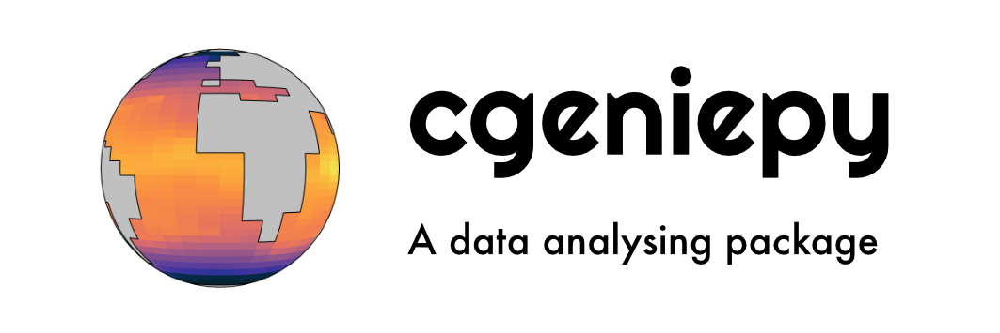

<p align="center">
  
</p>

[](https://cgeniepy.readthedocs.io/en/latest/?badge=latest)
[](https://badge.fury.io/py/cgeniepy)

[](https://doi.org/10.21105/joss.06762)
[](https://doi.org/10.5281/zenodo.13799838)
[](https://www.gnu.org/licenses/gpl-3.0)

`cgeniepy` is a Python package to analyse the output of [cGENIE Earth System Model](https://www.seao2.info/mymuffin.html). It aims to provide a set of convenient tools for the post-simulation work, including analysing the model output, plotting publication-quality figures, and conducting model-data comparison.


## Installation

1. Install from [PyPI](https://pypi.org/project/cgeniepy/) by running commands below in your terminal.

```bash
python3 -m pip install cgeniepy
```

2. Install from GitHub:

```bash
python3 -m pip install git+https://github.com/ruiying-ocean/cgeniepy.git@master
```
3. Install from conda
```bash
conda install --channel "ruiying" cgeniepy
```
 
4. Install extra dependency
```bash
python3 -m pip install "cgeniepy[extra]"
```

5. Update package
```bash
pip install --upgrade cgeniepy
```


## Quickstart
I have uploaded a sample model run, which is a [preindustrial spinup configuration](https://doi.org/10.5194/gmd-17-1729-2024) with marine ecosystem and biogeochemistry enabled (C, P, Fe, Si, O). 

```python
import cgeniepy
from cgeniepy.model import GenieModel

model = cgeniepy.sample_model()
## for your own model experiment
model = GenieModel("directory_to_your_model_output")

## select variable -> select coordinate -> operation like mean or plot
model.get_var('ocn_sur_temp').isel(time=-1).plot(colorbar=True)
```

* If you want to try other cGENIE model runs, you may go to this zenodo record (https://zenodo.org/records/10575295). 
* If you want to try non-cGENIE model, I have also uploaded two example files to here (https://zenodo.org/records/13786014). 


## Documentation

[An online documentation is hosted in readthedoc.](https://cgeniepy.readthedocs.io/en/latest/)


## Citation

Ying, R. (2024). cgeniepy: A Python package for analysing cGENIE Earth System Model output. Journal of Open Source Software, 9(101), 6762. https://doi.org/10.21105/joss.06762

## Logo

Logo is designed by me using free **righteous** font.

## Alternative
* Prof. Andy Ridgwell's [muffinplot](https://github.com/derpycode/muffinplot)
* Dr. Alex Phol's [genie_basicdiags](https://github.com/alexpohl/genie_basicdiags/)

## Raise a bug

Please use GitHub's Issues to raise a bug. This makes the issues traceable so that future users having the same problem can find the answer in the public domain.

## Contributing

[How to contribute](CONTRIBUTING.md)
