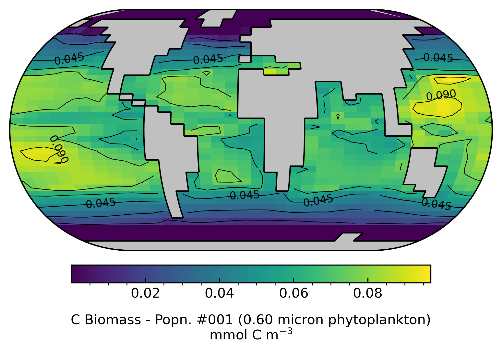
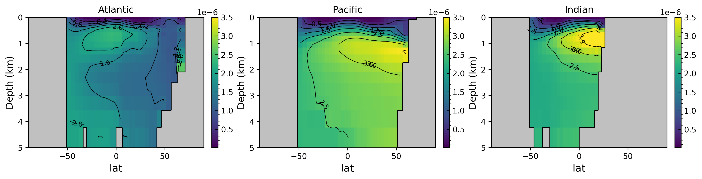
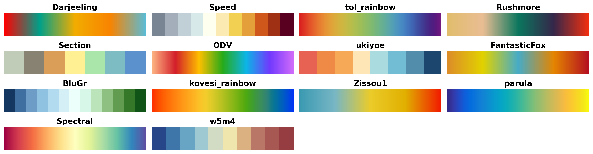

<p align="center">
  
</p>

`cgeniepy` is an Python interface to the output of [cGENIE Earth System Model](https://www.seao2.info/mymuffin.html). It is an alternative to the exisiting [MATLAB libraries](https://github.com/derpycode/muffinplot). It aims to do three things:

+ Read model output
+ Data analysis
+ Data visualisation
  
## Installation

`cgeniepy` is still under active development. But welcome to try the features after downloading cgeniep from [testpypi](https://test.pypi.org/project/cgeniepy/).

```bash
python3 -m pip install -i https://test.pypi.org/simple/ cgeniepy==0.7.5
```

## Usage
### 0. initialise a model instance
```python
from cgeniepy.model import GenieModel

## single model
model = GenieModel('path_a')

## model ensemble
multi_dirs = ['/path_a/', '/path_b/']
model = GenieModel(path_to_model_output)
```


### 1. Read data
+ netCDF (*.nc)
+ time series (*.res)

```python
## time slice data
model.get_var("XXXXX").array

## timeseries data
model.get_ts("biogem_series_ocn_temp.res")
```

### 2. Data analysis
+ Data subsetting and statistics
+ Model performance
+ Unit-changing operation (e.g., rate to magnitude)

```python
## get zonal average SST of the last model year
zonal_sst = model.get_var("ocn_sur_temp").isel(time=-1).mean(dim='lat')

## North Pacific SST
npac_sst = model.get_var("ocn_sur_temp").select_basin(47).isel(time=-1)
```

### 3. Visualisation
+ 1D line (time series, zonal average)
+ 2D map (including various projections like polar map)
+ 2D cross section
+ 3D (facet)
+ Add a layer of observational data

```python
## simply call `plot` after accessing the data

## map
model.get_var("ocn_sur_temp").isel(time=-1).plot()
```

### 4. Others
+ ECOGEM shortcuts

```python
from cgeniepy.ecology import EcoModel
model = EcoModel(path_to_model_path)
## get all phytoplankton carbon biomass and plot as map
model.get_pft("Phyto", "Biomass", "C").isel(time=-1).plot()
```

## Gallery

### A global biomass map of modelled picophytoplankton (0.6 μm) 

```python
## initialise a EcoModel instance before running this

model.get_pft(1, "Biomass", "C").isel(time=-1).plot(contour=True)
```




### A global distribution of basin-level nutrient (PO4) 

```python
## initialise a GenieModel instance before running this

import matplotlib.pyplot as plt

fig, axs=plt.subplots(nrows=1, ncols=3, figsize=(15, 3), tight_layout=True)        

basins = ['Atlantic', 'Pacific', 'Indian']

for i in range(3):
	basin_data = model.get_var('ocn_PO4').isel(time=-1).mask_basin(base='worjh2',basin=basins[i], subbasin='')
	basin_data.array.values = basin_data.array.values * 1E6
	basin_data.mean(dim='lon').plot(ax=axs[i], contour=True)
	axs[i].title.set_text(basins[i])
```




### Additional Colour Palettes

```python
import numpy as np
import matplotlib.pyplot as plt
from cgeniepy.plot import community_palette, avail_palette

def plot_colormaps(cmaps):
    ncols = 4
    nrows = int(np.ceil(len(cmaps) / ncols))
    fig, axes = plt.subplots(nrows, ncols, figsize=(15, nrows))

    for i, cmap_name in enumerate(cmaps):
        row = i // ncols
        col = i % ncols
        ax = axes[row, col] if nrows > 1 else axes[col]

        # Create a gradient image using the colormap
        gradient = np.linspace(0, 1, 256).reshape(1, -1)
        ax.imshow(gradient, aspect='auto', cmap=community_palette(cmap_name))
        ax.set_title(cmap_name, fontsize=14, fontweight='bold')
        ax.axis('off')

    ## remove the unused axes
    for i in range(len(cmaps), ncols * nrows):
        row = i // ncols
        col = i % ncols
        fig.delaxes(axes[row, col])
        
    plt.tight_layout()

# List of colormaps from cgeniepy
cmaps_list = avail_palette()
plot_colormaps(cmaps_list)
```




## Project Roadmap 🚩

- [ ] Publish the first stable version
- [ ] Examples and Documentation
- [ ] plot.py 3D facet subplots
- [ ] plot.py scatter data overlay
- [ ] ignore NAs when searching grid 
- [ ] use lat/lon/zt from GENIE output
- [ ] Move the computation functions in ecology.py and foram.py to array.py
- [ ] Show one colorbar in transect plot
- [X] figsize influences colorbar length
- [x] create a simple logo
- [X] allow reading an ensemble of models (netcdf & timeseries)
- [X] formatting the ugly unit string
- [ ] observation.py including plot scatter

## Citation

```latex
@software{cgeniepy,
  author = {Rui Ying},
  title = {A Python interface to analyse and visualise cGENIE model output},
  url = {https://github.com/ruiying-ocean/cgeniepy/},
  version = {0.7.5},
  date = {2023-11-12},
}
```

## Logo

Logo is generated by [simple logo generator](https://github.com/creecros/simple_logo_gen) using free **righteous** font.

## Alternative
Alex Phol's [genie_basicdiags](https://github.com/alexpohl/genie_basicdiags/)

## Raise a bug

Please use GitHub's Issues to raise a bug. This makes the issues traceable so that future users having the same problem can find the answer in the public domain.
